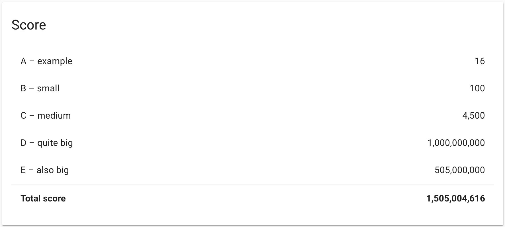

# hashcode2020-prep
A solution for the practice round of Google HashCode 2020 

## Problem statement

> You are organizing a Hash Code hub and want to order pizza for your hub’s
paicipants. Luckily, there is a nearby pizzeria with really good pizza.
The pizzeria has dierent types of pizza, and to keep the food oering for your hub
interesting, you can only order at most one pizza of each type. Founately, there are
many types of pizza to choose from!
> 
> Each type of pizza has a specied size: the size is the number of slices in a pizza of this
type.
>
> You estimated the maximum number of pizza slices that you want to order for your
hub based on the number of registered paicipants. In order to reduce food waste,
your goal is to order as many pizza slices as possible, but not more than the
maximum number.

Source: [Google Hashcode Judge System](https://hashcodejudge.withgoogle.com/#/rounds/4684107510448128/)

## Implemented solvers

1. Very basic genetic algorithm
2. Dynamic programming approach
3. Right-to-left item getting (RTL)

## Results

*Problem* | *Solver* | *Score*
--- | --- | ---
a_example | dynamic | 16
b_small | dynamic | 100
c_medium | dynamic | 4500
d_quite_big | RTL | 999999932
e_also_big | RTL | 505000000

The total score is *1,505,004,548* (68 points below the best known solution)

